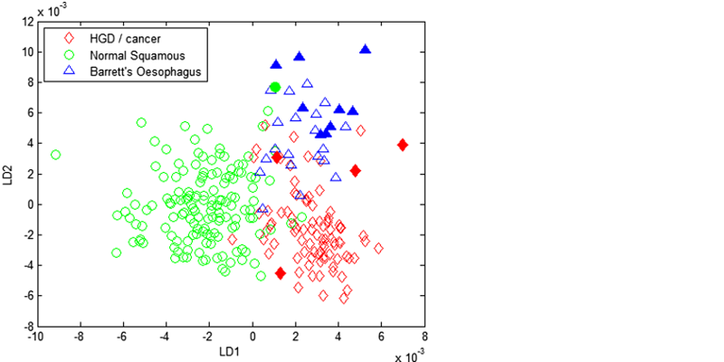
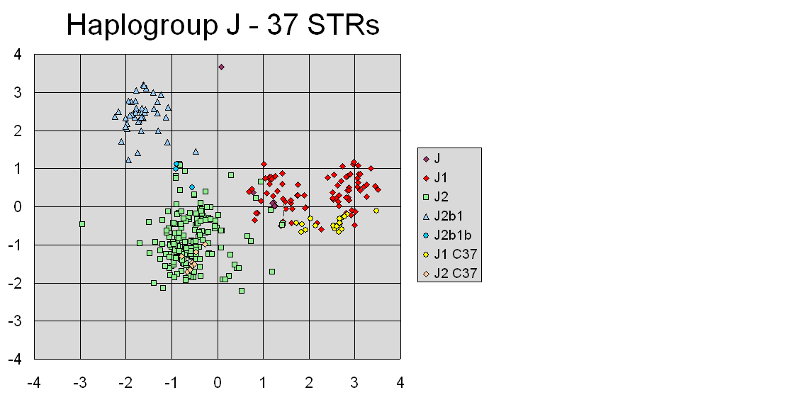
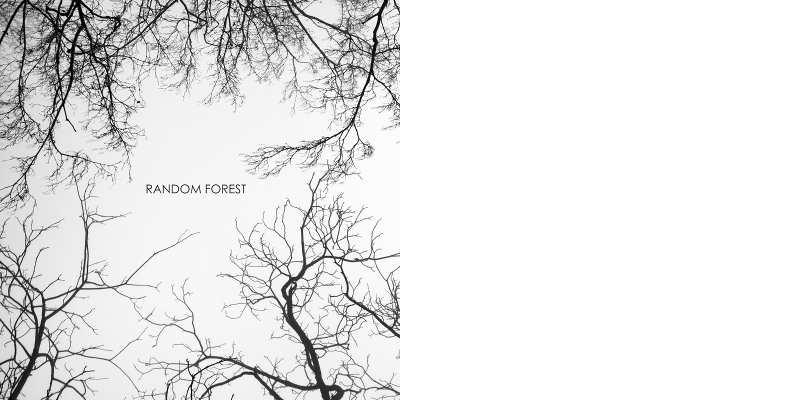

\pagenumbering{gobble}

# Exploration et classification de données avec R

(Insert image here)

**Eric Normandeau - 2015-01-27**

\newpage

# Exploration et classification de données avec R
## Objectifs
- Découvrir 3 techniques d'exploration et de classification de données
- PCA, LDA, Random Forest
- Tester ces techniques dans R
- Faire un survol superficiel

\newpage

# À propos des présentations du club

## Format
- Similaire aux Interlabs IBIS
- Dimension analyses (analyses, programmes, code...)
- Exposer son expérience personnelle avec les analyses
- Pas simplement présenter des articles

## Disponibilité
- Présentations et le matériel de support mis en ligne
- [Page GitHub du club](https://github.com/enormandeau/club_bioinfo_ibis)

\newpage

# PCA

\newpage

# PCA
## Description
- Explorer les sources de variances principales d'un jeu de données.
- Aucune connaissances *a priori* des données (untrained, non-supervisé).
- Visualisation.

## Utilité en biologie/génétique/génomique
- Connaître quelles variables permettent de regrouper des échantillons.
- Identifier importance de différentes sources de variation.
- Visualiser le regroupement 'naturel' des données.

## Limites
- Plus compliqué si on souhaite avoir une *p-valeur* pour la contribution des variables aux axes.
- Plutôt, descriptif.

\newpage

# LDA

\newpage

# LDA
## Description
- Utiliser un ensemble d'échantillons pour prédire l'appartenance d'autres échantillons.
- Connaissance *a priori* de la classification (trained, supervisé).
- Problème de classification.
- Visualisation.

## Utilité en biologie/génétique/génomique
- Classification d'individus en catégories (eg: sain, infecté).
- Utilisation d'individus comme bio-marqueurs de pollution.

## Limites
- Requiert un grand nombre d'échantillons d'entraînement.
- Moins approprié/puissant quand il y a un grand nombre de variables.
- Les échantillons à classifier doivent être comparables aux échantillons d'entraînement.

\newpage

# Random Forest

\newpage

# Random Forest
## Description
- Classification ou régression à partir d'un jeu de données d'apprentissage.
- Connaissance *a priori* de la classification (trained, supervisé).
- Problème de classification ou de régression.
- Visualisation.

## Utilité en biologie/génétique/génomique
- Très approprié si le nombre de variables est très élevé (eg: expression de gènes ou marqueurs SNPs).
- Classification d'individus en catégories (eg: sain ou infecté, par population).
- Prédiction de réponse par régression en utilisant de nombreuses variables.
- Utilisation d'individus comme bio-marqueurs de pollution.
- Identifier variables importantes (valeur d'importance).

## Limites
- Méthode encore plutôt nouvelle en biologie (existe depuis ~10 ans).
- Valeur d'importance réduite lorsqu'on utilise des marqueurs génétiques liés.

